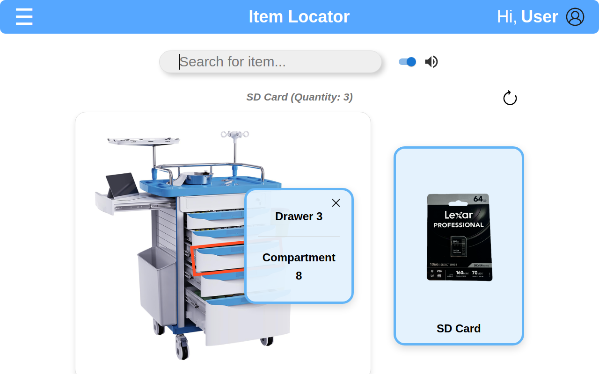

# CueBot: Toward Multimodal Guidance for Cart-Based Human-Robot Collaboration

This repository accompanies the HRI 2027 submission *CueBot: Toward Multimodal Guidance for Cart-Based Human-Robot Collaboration*. It contains the CueBot web interface and backend, the hardware build guide, and documentation of the supplies used in the user study.

CueBot is a low-cost robotic cart that guides people to items stored in its drawers. It uses three communication channels:

- **Web interface.** A diagram of the cart with the target drawer outlined, a pop-up with the drawer and compartment numbers, and a card with the item's name and photo. The item's name and quantity appear at the top of the screen.
- **LED indicators.** Light-blue LEDs mark the correct drawer on the outside of the cart and the correct compartment inside it. In the study, the hidden operator switched on the lights for all of a condition's target items at once, not through this software.
- **Speech.** A short clip announces the location, for example "Located in drawer two, compartment three." Speech can be turned on or off with the toggle next to the search bar.

The whole platform costs about $658 and uses only off-the-shelf hardware and open-source software.

> **About the study setup.** The study used a Wizard-of-Oz protocol: a hidden operator delivered the guidance cues, so that the effect of each communication channel could be measured separately from sensing errors. The operator switched the LED indicators on by hand, so this repository contains no LED control code. It also does not include autonomous item detection. What it does contain is the web interface and speech system used in the study.

> **Note on terminology.** The paper refers to the first subgroup as *non-clinicians*. The code and data files use `layperson`, the label used during data collection.



## Contents

- [Repository structure](#repository-structure)
- [Requirements](#requirements)
- [Quick start](#quick-start)
- [Choosing a cart layout](#choosing-a-cart-layout)
- [Configuration](#configuration)
- [Using the interface](#using-the-interface)
- [Study conditions](#study-conditions)
- [Adapting CueBot to your own cart](#adapting-cuebot-to-your-own-cart)
- [Hardware](#hardware)
- [Troubleshooting](#troubleshooting)
- [License](#license)

## Repository structure

```
cuebot/
├── backend/                     Node.js/Express server
│   ├── server.js                Serves inventory data, item photos, and speech clips
│   ├── inventory-layperson.json Layperson cart: items and their locations
│   ├── inventory-rn.json        Registered nurse cart: items and their locations
│   └── public/
│       ├── images-layperson/    Item photos for the layperson cart
│       ├── images-rn/           Item photos for the RN cart
│       ├── audio-layperson/     Speech clips for the layperson cart ({drawer}-{compartment}.mp3)
│       └── audio-rn/            Speech clips for the RN cart
├── frontend/                    React web interface (Vite)
│   └── src/
│       ├── config.js            Backend address and cart selection
│       ├── components/
│       │   ├── ItemLocator/     The retrieval interface used in the study
│       │   ├── NavBar/          Top bar
│       │   └── InventoryTracker/, InventoryCards/, InventoryCardsList/
│       │                        An earlier design iteration (not used in the study)
│       └── assets/
│           ├── cart-layperson/  Cart diagrams with each drawer outlined
│           └── cart-rn/         Cart photos with each drawer outlined
├── hardware/                    Hardware build guide and parts list
├── study-materials/             Cart layouts and item lists for both participant groups
└── docs/                        Images used in this README
```

## Requirements

- [Node.js](https://nodejs.org/) version 18 or later (this includes npm)
- A current version of Chrome, Edge, Firefox, or Safari

You do not need any hardware to try the interface. Search, the cart diagram, and speech all work on an ordinary computer. The LEDs are part of the physical cart and are operated separately from the software.

## Quick start

**1. Download the code** and open a terminal in the `cuebot` folder.

**2. Install the dependencies** for the backend and the frontend:

```bash
cd backend
npm install
cd ../frontend
npm install
cd ..
```

**3. Start the backend.** In a terminal, run:

```bash
cd backend
npm start
```

You should see `CueBot backend listening on http://localhost:8080 (cart: layperson)`. Leave this terminal open.

**4. Start the frontend.** Open a second terminal and run:

```bash
cd frontend
npm run dev
```

**5. Open the interface** at [http://localhost:5173](http://localhost:5173).

**6. Try a search.** Type `SD card` and press Enter. The cart diagram should outline drawer 3, a pop-up should show compartment 8, and you should hear "Located in drawer three, compartment eight."

> **Browser audio note.** Some browsers block sound until you have clicked on the page. If you don't hear the speech clip, click anywhere on the page and search again.

## Choosing a cart layout

The study used two carts, and the software includes both. See [`study-materials/`](study-materials/README.md) for their full contents.

| Cart | Used with | Supplies |
|---|---|---|
| `layperson` (default) | 11 layperson participants | Office, lab, and workshop supplies |
| `rn` | 5 registered nurses | Medical crash-cart supplies |

To use the RN cart, set the cart on **both** the backend and the frontend.

Backend (macOS or Linux):

```bash
cd backend
npm run start:rn
```

Frontend: create a file named `.env` in the `frontend` folder containing:

```
VITE_CART=rn
```

Then restart `npm run dev`.

On Windows (PowerShell), start the backend with `$env:CUEBOT_CART="rn"; npm start` instead.

## Configuration

Both parts of the system work without any configuration. These settings are only needed if you want to change a port or the cart layout.

**Backend** (set as environment variables; see `backend/.env.example`):

| Variable | What it does | Default |
|---|---|---|
| `CUEBOT_CART` | Which inventory file to load (`layperson` or `rn`) | `layperson` |
| `PORT` | Port the backend listens on | `8080` |
| `FRONTEND_ORIGIN` | Address of the frontend, used for Socket.IO | `http://localhost:5173` |

**Frontend** (put these in `frontend/.env`; see `frontend/.env.example`):

| Variable | What it does | Default |
|---|---|---|
| `VITE_API_URL` | Address of the backend | `http://localhost:8080` |
| `VITE_CART` | Which cart diagram to show (`layperson` or `rn`) | `layperson` |

If you change the backend port, update `VITE_API_URL` to match.

## Using the interface

1. **Search for an item.** Type part of its name. Suggestions appear after two characters, and small typos are tolerated. Press Enter or click a suggestion.
2. **Read the result.** The cart diagram outlines the drawer, a pop-up gives the drawer and compartment numbers, and a card shows the item's photo and name. The item name and quantity appear above the diagram.
3. **Listen to the cue.** If the speaker toggle is on, the location is read aloud.
4. **Clear or refresh.** The × button clears the result. The refresh button reloads the inventory from the backend.

## Study conditions

Each participant completed the retrieval task under six conditions. The table shows which channels were active in each one.

| Condition | Web interface | LEDs | Speech |
|---|:-:|:-:|:-:|
| C1 Manual search (paper task card only) | | | |
| C2 Web interface only | ✓ | | |
| C3 Web interface + LEDs | ✓ | ✓ | |
| C4 LEDs only | | ✓ | |
| C5 Speech only | | | ✓ |
| C6 Web interface + speech | ✓ | | ✓ |

In C2 and C3, the speech toggle was turned off. In C3 and C4, the hidden operator used a remote control to switch on the LEDs for all five target items at the start cue, so every target drawer and compartment was lit at the same time; the software does not control the LEDs. In C5 and C6, the hidden operator played the speech clips remotely, one item at a time, within 2 seconds of the participant finishing the previous item (or of the start cue, for the first item). In C5, the participant could not see the web interface.


## Adapting CueBot to your own cart

CueBot is not tied to a particular cart. To set it up for a new one, you need four things: an inventory file, item photos, speech clips, and drawer images.

**1. Inventory file.** Create `backend/inventory-<name>.json`, following the format of the existing files:

```json
{
  "inventory": [
    {
      "drawer": 1,
      "compartments": [
        {
          "compartment": 1,
          "item": "Pliers",
          "count": 2,
          "image": "/public/images-<name>/pliers.png",
          "audio": "/public/audio-<name>/1-1.mp3"
        }
      ]
    }
  ],
  "ledStates": [],
  "isDeprecated": []
}
```

Each compartment holds one item. `count` is the quantity shown in the interface. `ledStates` and `isDeprecated` are only used by the earlier inventory-tracker design and can be left empty.

**2. Item photos.** Put one photo per item in `backend/public/images-<name>/`. Photos with a transparent or white background look best.

**3. Speech clips.** Put one clip per compartment in `backend/public/audio-<name>/`, named `{drawer}-{compartment}.mp3`. Each clip should say "Located in drawer {drawer}, compartment {compartment}." Any text-to-speech tool that exports MP3 will work.

**4. Drawer images.** Create `frontend/src/assets/cart-<name>/` containing `crash-cart.png` (the cart with no drawer highlighted) and `crash-cart-d1.png`, `crash-cart-d2.png`, and so on, each with one drawer outlined.

Then start the backend with `CUEBOT_CART=<name>` and set `VITE_CART=<name>` in `frontend/.env`.

## Hardware

The parts list, costs, and assembly steps are in [`hardware/`](hardware/README.md). In short, the platform is a mobile drawer cart fitted with battery-powered, remote-controlled LED lights and a Bluetooth speaker, with the interface running on a laptop. The lights are taped in place, so no wiring is needed, and the Wizard-of-Oz operator switches them with their remotes rather than through the software. A Raspberry Pi 4B with a small screen (about $45) can replace the laptop for a self-contained cart.

## Troubleshooting

**"Failed to connect to the inventory server."** The backend is not running, or it is on a different port than the frontend expects. Start the backend, or check that `VITE_API_URL` matches its address, then click **Try Again**.

**The search finds the wrong kind of items** (for example, office supplies when you expected medical supplies). The backend and frontend are set to different carts. Make sure `CUEBOT_CART` and `VITE_CART` match, then restart both.

**No speech.** Check that the speaker toggle is on, that your computer's volume is up, and that the correct audio output (for example, the Bluetooth speaker) is selected. Some browsers also need you to click on the page before they will play sound.

**"Port already in use."** Another program is using port 8080 or 5173. Stop that program, or change `PORT` (backend) and `VITE_API_URL` (frontend).

**`npm install` fails.** Check your Node.js version with `node --version`. CueBot needs version 18 or later.

## License

This project is released under the MIT License. See [LICENSE](LICENSE).
